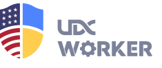

[](https://hub.docker.com/r/usabilitydynamics/udx-worker) [](LICENSE) [](https://udx.dev/worker)

Container runtime foundation for UDX automation images.

[Quick Start](#quick-start) | [Documentation](#documentation) | [Development](#development)

## Overview

UDX Worker is a base container image for automation workloads that need predictable runtime config, secret references, and process supervision.

It provides:

- `worker.yaml` for runtime env values, secret references, and opt-in runtime output.
- `services.yaml` for supervised processes inside the container.
- Secret reference resolution from AWS, Azure, and Google Cloud after provider auth exists.
- A shared CLI for inspecting and re-applying container runtime config.
- A stable base for child images that add workload-specific tools.

## Quick Start

### Prerequisites

- Docker 20.10 or later
- Make (for development)

### Example 1: Simple Service

```bash
# Create project structure
mkdir -p my-worker/.config/worker
cd my-worker

# Create a simple service script
cat > index.sh <<'EOF'
#!/bin/bash
echo "Starting service..."
trap 'echo "Shutting down..."; exit 0' SIGTERM
while true; do
    echo "[$(date)] Service running..."
    sleep 5
done
EOF
chmod +x index.sh

# Create service configuration
cat > .config/worker/services.yaml <<'EOF'
kind: workerService
version: udx.io/worker-v1/service
services:
  - name: "index"
    command: "/home/udx/index.sh"
    autostart: true
    autorestart: true
EOF

# Run the worker
docker run -d \
  --name my-service \
  -v "$(pwd):/home/udx" \
  usabilitydynamics/udx-worker:latest

# View service logs
docker logs -f my-service
```

### Example 2: Secret References

```bash
# Define secrets configuration
cat > .config/worker/worker.yaml <<'EOF'
kind: workerConfig
version: udx.io/worker-v1/config
config:
  secrets:
    API_KEY: "gcp/my-project/api-key"
    DB_PASS: "aws/database-password/us-west-2"
EOF

# Run with provider auth injected by the host/platform
docker run -d \
  --name my-secrets \
  -v "$(pwd)/.config/worker:/home/udx/.config/worker" \
  usabilitydynamics/udx-worker:latest

# Verify the resolved environment without printing the secret value
docker exec my-secrets sh -lc 'worker env show --filter API_KEY --format json | jq -e '\''has("API_KEY") and .API_KEY != ""'\'' >/dev/null'
```

See [Secrets](docs/secrets.md) for secret references and provider auth boundaries.

### Deployment

Deployment uses the host-native tool for the target environment. Mount runtime config into the container and pass provider credentials, workload identity, or secret references through the platform.

```bash
docker run --rm \
  -v "$(pwd)/.config/worker:/home/udx/.config/worker:ro" \
  -e API_KEY="gcp/my-project/api-key" \
  usabilitydynamics/udx-worker:latest
```

For Kubernetes, mount `worker.yaml` and `services.yaml` through ConfigMaps or Secrets and deploy the image with normal Kubernetes manifests.

### Development Setup

```bash
# Clone and build
git clone https://github.com/udx/worker.git
cd worker
make build

# Run example service
make run VOLUMES="$(pwd)/src/examples/simple-service:/home/udx"

# View logs
make log FOLLOW_LOGS=true

# Run tests
make test
```

More examples available in [src/examples/README.md](src/examples/README.md).

## Documentation

- [CLI](docs/cli.md) - runtime inspection and re-apply commands
- [Config](docs/config.md) - `worker.yaml`, env values, runtime output
- [Secrets](docs/secrets.md) - secret references and provider auth boundaries
- [Services](docs/services.md) - `services.yaml` process config
- [Deployment](docs/deployment.md) - Docker, Kubernetes, and CI usage
- [Development](docs/development.md) - Build, test, and child image workflow
- [Reference Docs](docs/references/README.md) - provider auth options and container structure
- [Examples](src/examples/README.md) - Runnable samples

## Development

```bash
# Clone repository
git clone https://github.com/udx/worker.git
cd worker

# Build image
make build

# Run container
make run      # Detached mode
make run-it   # Interactive mode

# Run tests
make test

# View all commands
make help
```

## Resources

- [Docker Hub](https://hub.docker.com/r/usabilitydynamics/udx-worker)
- [Documentation](https://udx.dev/worker)
- [Product Page](https://udx.io/products/udx-worker)

## Custom Development

Need specific features or customizations?
[Contact our team](https://udx.io/) for professional development services.

## License

This project is licensed under the MIT License - see the [LICENSE](LICENSE) file for details.

---
<div align="center">
Built by <a href="https://udx.io">UDX</a> © 2025
</div>
